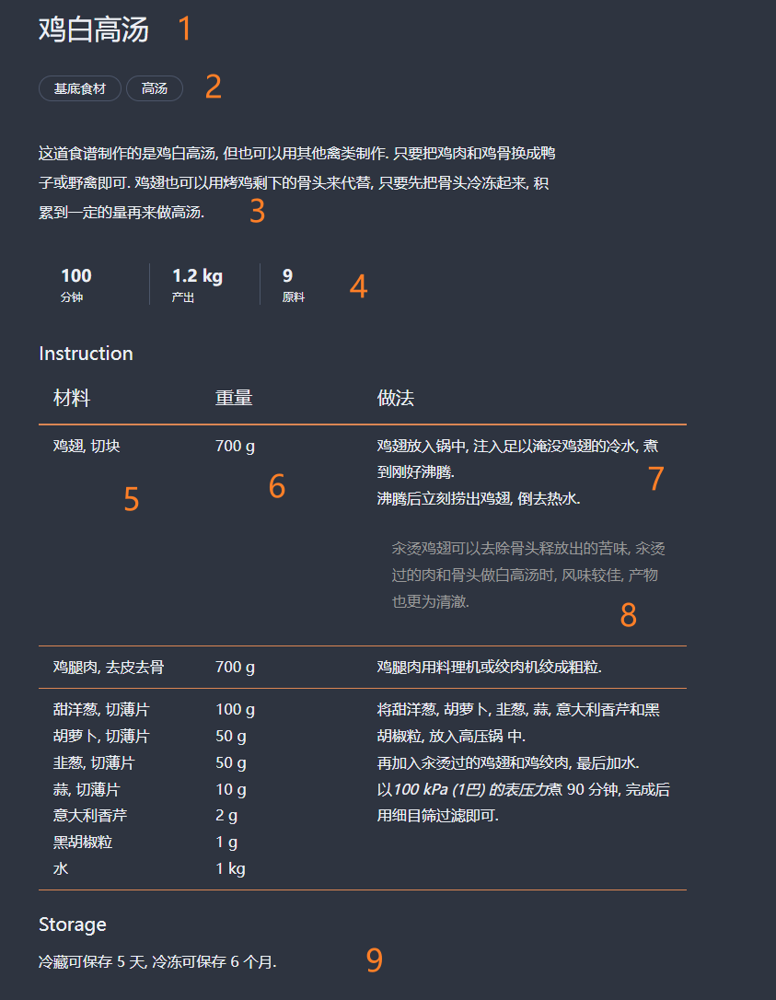

# Ambrosia

结构化的开源食谱

## 这是什么？

本项目受到了[程序员做饭指南](https://github.com/Anduin2017/HowToCook)的启发, 致力于构建一个以程序员角度来看待菜谱的仓库.

本项目中的菜谱均使用 [Cooklang](https://cooklang.org) 编写, 在其基础上有少量的优化以提高可读性.

## 为什么又做一个菜谱仓库

Github 上也有一些其他的食谱类仓库, 也都说自己开源. 但在我看来, 食谱本身并不是开源的, 它们只是很多操作步骤的一个集合, 是一些说明, 而不是像开源项目一样是一个可被依赖和使用的东西.

本项目中, 将着重于那些**可复用的组件**, 而不是需要遵照的指引. 我们将对菜谱进行拆分重组, 抽象分离出可重用的组件, 并提供一些利用这些组件组装出来的料理作为示例. 在日常生活中, 我们可以去准备一些这样的组件, 这样在关键时候, 可以很快很轻松的构建出一桌丰盛而又美味的佳肴.

同时, 在项目开发过程中, 我们将会整理一批参数食谱, 这些食谱就是一个可被复用的函数, 用户可以将其他食材替代进去, 创造属于自己的菜肴.

## 如何阅读菜谱

1. 菜谱名称
2. 菜谱类别和标签
3. 菜谱基本说明
4. 菜谱的一些元信息, 包括耗时, 产出, 原料数量和可供几人食用
5. 菜谱会被分成多行, 每一行内有三列. 第一列代表这一步中所用到的所有食材, 食材名后面可能以逗号分隔标注前置处理步骤, 建议提前准备.
6. 第二列代表对应食材的重量或体积, 菜谱均采用重量作为标准单位, 但部分食材可能会有额外的体积说明以方便取用. (WIP)
7. 第三列代表这一步的所有细节步骤
8. 可能会使用引用格式来表示目的, 或可选项.
9. 所有菜谱均会给出可保存的时间.
